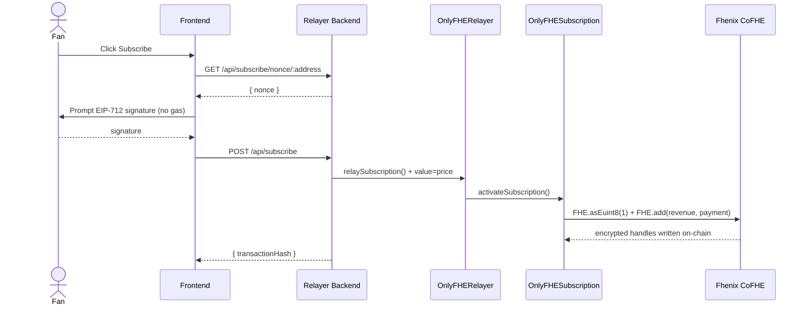
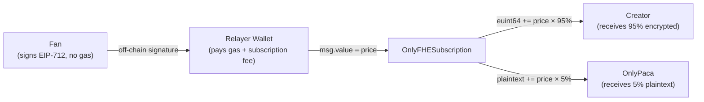

# OnlyPaca

Privacy-first creator subscription platform powered by Fhenix CoFHE (Fully Homomorphic Encryption) on Arbitrum Sepolia.

## The Problem

**Web2 platforms betray you.** OnlyFans can freeze your account, sell your subscriber list, or hand data to authorities — your economic relationship is controlled by intermediaries.

**Naive on-chain is worse.** Moving to a public blockchain solves censorship, but creates a privacy catastrophe: every subscription is permanently visible on Etherscan. Anyone can enumerate creators, query subscribers, and build a social graph.

**FHE is the only solution.** Fully Homomorphic Encryption computes on encrypted data without decrypting it. Subscription relationships are stored as ciphertext (`euint8`), creator revenue accumulates as ciphertext (`euint64`), and only authorized parties can decrypt their own data. No one else — not even us — can read it.

## Overview

OnlyPaca implements a **three-layer privacy architecture**:

1. **Relayer pattern** — Fans sign EIP-712 messages off-chain. The Relayer submits transactions, so fan wallets never touch the contract.
2. **FHE encrypted state** — Subscriptions and revenue are stored as ciphertext on-chain. Even if you read the storage slot, you see only noise.
3. **Permission-based decryption** — Only the subscriber can verify their own access. Only the creator can view their own revenue. The platform operator is cryptographically locked out.

**Live:**
- Frontend: https://only-paca.vercel.app
- Relayer API: https://onlypaca.onrender.com/api/health

**Contracts (Arbitrum Sepolia):**
- `OnlyFHESubscription`: `0xdcDeA2a2F979c3D905331765349f167828aF4c3c`
- `OnlyFHERelayer`: `0x51dc4d07b7e0fdd3aeA06F547fF16E07E4545228`

---

## Documentation

| Document | Description |
|---|---|
| [Problem Narrative](docs/00_narrative.md) | Why Web2 fails, why naive on-chain is worse, why FHE is the only solution |
| [Product Requirements](docs/01_product_requirements.md) | PRD — user stories, feature scope, acceptance criteria |
| [Smart Contracts](docs/02_smart_contracts.md) | Contract design, FHE types, function reference |
| [Technical Architecture](docs/03_technical_architecture.md) | System flow, sequence diagrams, API reference |
| [Business Architecture](docs/04_business_architecture.md) | Revenue model, user journeys, competitive landscape |
| [Whitepaper Outline](docs/05_whitepaper_outline.md) | Privacy analysis, cryptographic assumptions, future work |

---

## Project Structure

```
onlypaca/
├── contracts/     # Solidity smart contracts (Hardhat + CoFHE)
├── frontend/      # Next.js 14 web application
├── relayer/       # Node.js relay service (Express + ethers.js)
├── docs/          # Architecture and product documentation
└── shared/        # Shared types and constants
```

---

## Technical Architecture



---

## Business Architecture



---

## Tech Stack

| Layer | Technology |
|---|---|
| Smart Contracts | Solidity 0.8.25, `@fhenixprotocol/cofhe-contracts`, OpenZeppelin v5 |
| Contract Tooling | Hardhat 2.22, cofhe-hardhat-plugin, cofhejs |
| Frontend | Next.js 14, React 18, Tailwind CSS |
| Wallet | wagmi v2, viem, RainbowKit, WalletConnect |
| Relayer Backend | Node.js 20, Express 4, ethers.js v6, TypeScript |
| Network | Arbitrum Sepolia (chainId: 421614) |
| FHE | Fhenix CoFHE co-processor |

---

## Privacy Guarantees

| Data | Visible To | Protected By |
|---|---|---|
| Subscription relationship | Subscriber only | FHE `euint8` |
| Creator revenue | Creator only | FHE `euint64` |
| Subscriber identity | No one (relayer is `msg.sender`) | Relayer pattern + EIP-712 |
| Subscriber count | Public | Intentional (social proof) |

---

## Relayer API Reference

Base URL: `https://onlypaca.onrender.com`

| Endpoint | Method | Description |
|---|---|---|
| `/api/health` | GET | Health check |
| `/api/subscribe/nonce/:address` | GET | Get current nonce for EIP-712 signing |
| `/api/subscribe` | POST | Relay subscription (fan → creator) |
| `/api/subscribe/access-decrypt` | POST | Relay access verification request |
| `/api/subscribe/revenue-decrypt` | POST | Relay revenue decryption request |
| `/api/subscribe/withdraw` | POST | Relay creator withdrawal |
| `/api/creators` | GET | List all registered creators |
| `/api/creators/:address` | GET | Get creator profile |

All relay endpoints require EIP-712 signed messages. The relayer pays gas on behalf of users.

---

## Links

- [Fhenix Protocol](https://www.fhenix.io/)
- [CoFHE Documentation](https://docs.fhenix.zone/)
- [Arbitrum Sepolia Explorer](https://sepolia.arbiscan.io/)
