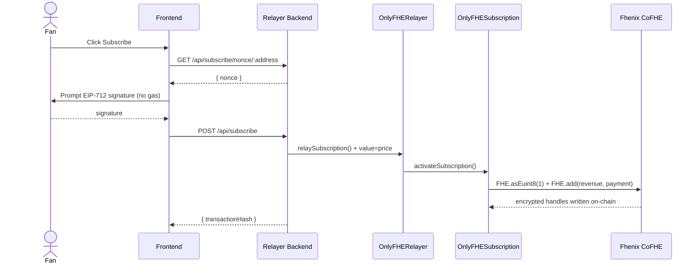
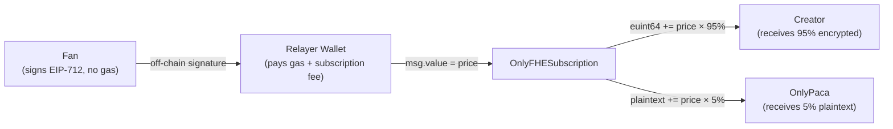

# OnlyPaca

Privacy-first creator subscription platform powered by Fhenix CoFHE (Fully Homomorphic Encryption) on Arbitrum Sepolia.

## Overview

OnlyPaca enables creators to monetize content while giving subscribers complete privacy. Subscription relationships and revenue are encrypted on-chain using FHE — even the platform operator cannot read this data.

**Live:**
- Frontend: https://only-paca-frontend.vercel.app
- Relayer API: https://onlypaca.onrender.com/api/health

**Contracts (Arbitrum Sepolia):**
- `OnlyFHESubscription`: `0x2451c1c2D71eBec5f63e935670c4bb0Ce19381f5`
- `OnlyFHERelayer`: `0xbd546CD2fc7A9F614c51fcE7AfE60464D39f9cC0`

---

## Documentation

| Document | Description |
|---|---|
| [Product Requirements](docs/01_product_requirements.md) | PRD — user stories, feature scope, acceptance criteria |
| [Smart Contracts](docs/02_smart_contracts.md) | Contract design, FHE types, function reference |
| [Technical Architecture](docs/03_technical_architecture.md) | System flow, sequence diagrams, API reference |
| [Business Architecture](docs/04_business_architecture.md) | Revenue model, user journeys, competitive landscape |
| [Whitepaper Outline](docs/05_whitepaper_outline.md) | Privacy analysis, cryptographic assumptions, future work |

---

## Project Structure

```
onlypaca/
├── contracts/     # Solidity smart contracts (Hardhat + CoFHE)
├── frontend/      # Next.js 14 web application
├── relayer/       # Node.js relay service (Express + ethers.js)
├── docs/          # Architecture and product documentation
└── shared/        # Shared types and constants
```

---

## Technical Architecture



---

## Business Architecture



---

## Tech Stack

| Layer | Technology |
|---|---|
| Smart Contracts | Solidity 0.8.25, `@fhenixprotocol/cofhe-contracts`, OpenZeppelin v5 |
| Contract Tooling | Hardhat 2.22, cofhe-hardhat-plugin, cofhejs |
| Frontend | Next.js 14, React 18, Tailwind CSS |
| Wallet | wagmi v2, viem, RainbowKit, WalletConnect |
| Relayer Backend | Node.js 20, Express 4, ethers.js v6, TypeScript |
| Network | Arbitrum Sepolia (chainId: 421614) |
| FHE | Fhenix CoFHE co-processor |

---

## Privacy Guarantees

| Data | Visible To | Protected By |
|---|---|---|
| Subscription relationship | Subscriber only | FHE `euint8` |
| Creator revenue | Creator only | FHE `euint64` |
| Subscriber identity | No one (relayer is `msg.sender`) | Relayer pattern + EIP-712 |
| Subscriber count | Public | Intentional (social proof) |

---

## Links

- [Fhenix Protocol](https://www.fhenix.io/)
- [CoFHE Documentation](https://docs.fhenix.zone/)
- [Arbitrum Sepolia Explorer](https://sepolia.arbiscan.io/)
