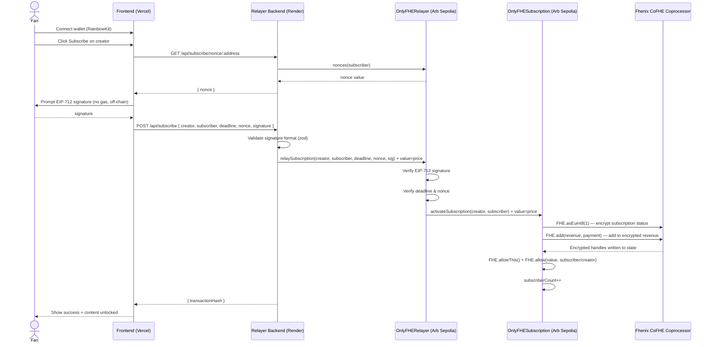
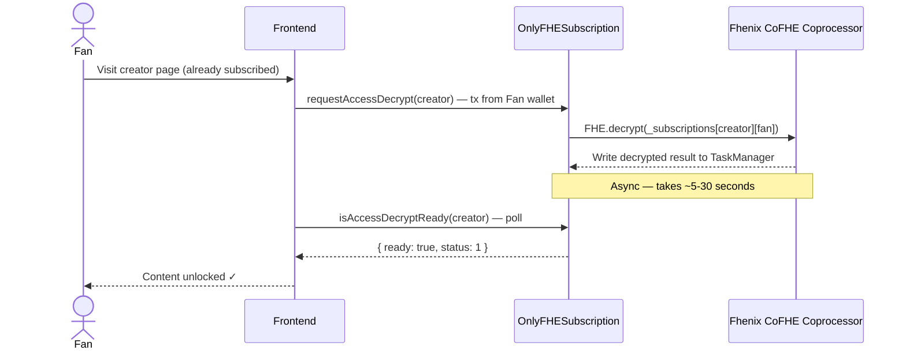
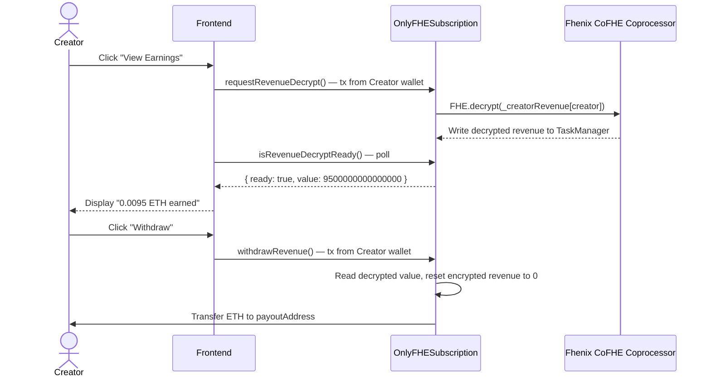
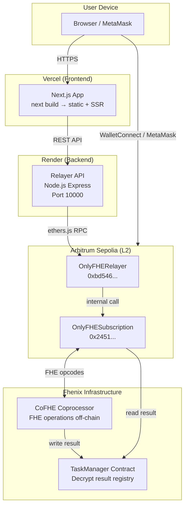

# OnlyPaca — Technical Architecture

> Version: 1.0
> Network: Arbitrum Sepolia
> FHE Layer: Fhenix CoFHE
> Last Updated: 2026-03

---

## 1. System Overview

OnlyPaca is a privacy-first creator subscription platform built as a monorepo with three independently deployable layers: smart contracts (Arbitrum Sepolia), a relayer backend (Node.js), and a frontend application (Next.js). All three layers communicate through well-defined interfaces, and the FHE coprocessor is an external service provided by Fhenix Protocol.

---

## 2. Monorepo Structure

```
onlypaca/
├── contracts/          # Hardhat + CoFHE — Solidity 0.8.25
├── frontend/           # Next.js 14 + wagmi + RainbowKit
├── relayer/            # Node.js + Express + ethers.js v6
├── shared/             # Shared ABIs, types, constants
└── docs/               # Project documentation
```

---

## 3. Layer Architecture

### 3.1 Smart Contract Layer

| Contract | Address (Arb Sepolia) | Role |
|---|---|---|
| `OnlyFHESubscription` | `0x2451c1c2D71eBec5f63e935670c4bb0Ce19381f5` | Core FHE logic: encrypted state, revenue accumulation, access control |
| `OnlyFHERelayer` | `0xbd546CD2fc7A9F614c51fcE7AfE60464D39f9cC0` | EIP-712 signature verification, forwards calls on behalf of subscribers |

Both contracts are deployed on **Arbitrum Sepolia (chainId: 421614)** and integrated with the **Fhenix CoFHE coprocessor** which processes FHE operations off-chain and writes encrypted results back on-chain.

### 3.2 FHE Data Layer

| Variable | FHE Type | Who Can Decrypt |
|---|---|---|
| `_subscriptions[creator][subscriber]` | `euint8` | Subscriber only (`FHE.allow(value, subscriber)`) |
| `_creatorRevenue[creator]` | `euint64` | Creator only (`FHE.allow(value, creator)`) |

Decryption is **asynchronous**: the contract calls `FHE.decrypt()` to request decryption from the CoFHE coprocessor, and the result is read back via `FHE.getDecryptResultSafe()`.

### 3.3 Relayer Backend

- **Runtime**: Node.js 20, TypeScript, compiled to CommonJS
- **Framework**: Express.js with helmet, cors, morgan, express-rate-limit
- **Chain interaction**: ethers.js v6, JsonRpcProvider
- **Deployment**: Render (Web Service, free tier for testnet)

### 3.4 Frontend

- **Framework**: Next.js 14 (App Router, SSR enabled)
- **Wallet**: wagmi v2 + RainbowKit + WalletConnect
- **Chain interaction**: viem (reads), wagmi hooks (writes/signing)
- **Deployment**: Vercel

---

## 4. Full System Flow



---

## 5. Access Verification Flow



---

## 6. Creator Revenue Flow



---

## 7. Deployment Architecture



---

## 8. API Reference (Relayer)

| Method | Endpoint | Description |
|---|---|---|
| `GET` | `/api/health` | Liveness check |
| `POST` | `/api/subscribe` | Relay a subscription (body: creator, subscriber, deadline, nonce, signature) |
| `GET` | `/api/subscribe/nonce/:address` | Get current EIP-712 nonce for a subscriber |
| `GET` | `/api/creators` | List all registered creators (scans on-chain events) |
| `GET` | `/api/creators/:address` | Get specific creator profile |

---

## 9. Security Model

| Threat | Mitigation |
|---|---|
| Subscriber identity exposure | Relayer is always `msg.sender`; user wallet never touches subscription contract |
| Signature replay | EIP-712 nonces + deadline + `usedSignatures` mapping |
| Creator revenue exposure | `euint64` encrypted on-chain; only creator can trigger decryption |
| Relayer unauthorized call | `onlyOwner` modifier on `relaySubscription()` |
| Reentrancy | `ReentrancyGuard` on all ETH-moving functions |
| Excessive platform fee | `MAX_PLATFORM_FEE_BPS = 1000` (10%) hard cap |
| Contract emergency | `emergencyWithdraw()` owner-only; relayer `setPaused()` |

---

## 10. Tech Stack Summary

| Layer | Technology |
|---|---|
| Smart Contracts | Solidity 0.8.25, `@fhenixprotocol/cofhe-contracts` v0.0.13, OpenZeppelin v5 |
| Contract Tooling | Hardhat 2.22, `cofhe-hardhat-plugin` v0.3.1, `cofhejs` v0.3.1 |
| Relayer Backend | Node.js 20, Express 4, ethers.js 6, TypeScript 5, zod |
| Frontend | Next.js 14, React, TypeScript, Tailwind CSS 3 |
| Wallet & Chain | wagmi v2, viem, RainbowKit, WalletConnect |
| Network | Arbitrum Sepolia (chainId: 421614) |
| FHE | Fhenix CoFHE (co-processor model) |
| Deployment | Vercel (frontend), Render (relayer) |
