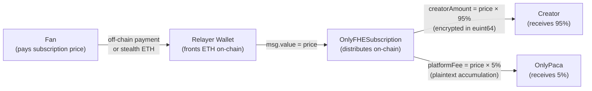
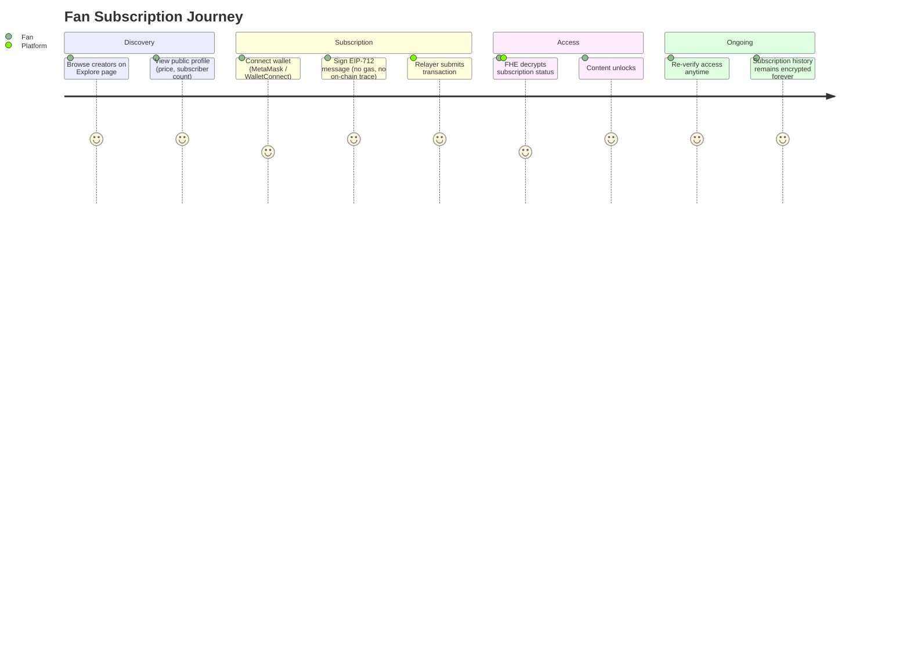
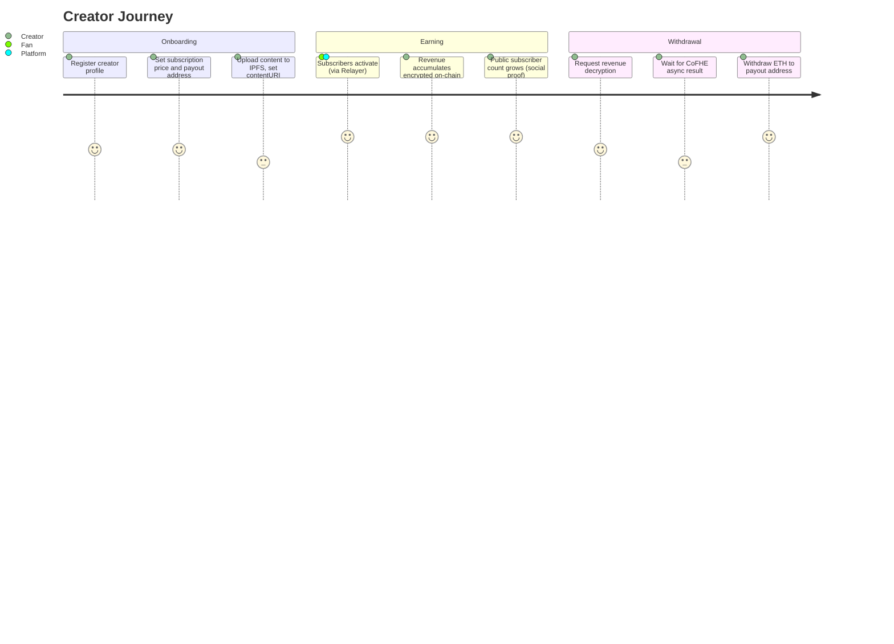
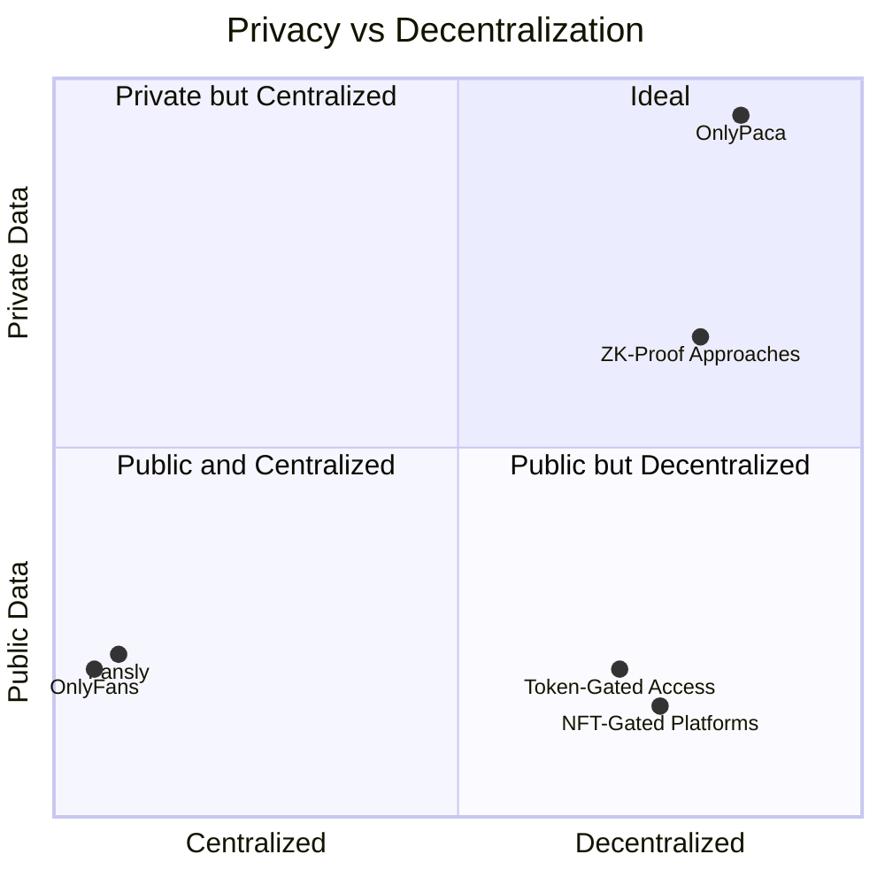
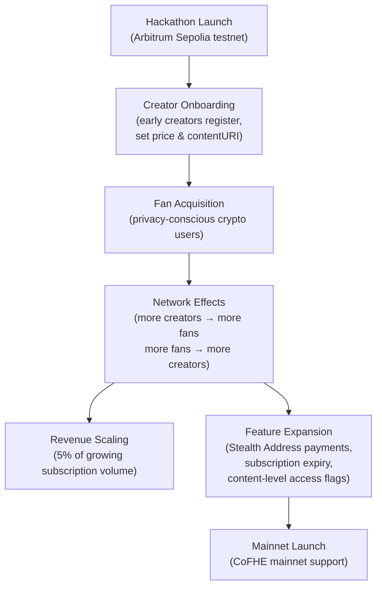

# OnlyPaca — Business Architecture

> Version: 1.0
> Last Updated: 2026-03

---

## 1. Market Position

OnlyPaca operates in the **adult creator subscription economy** — a market exceeding $5B annually, dominated by centralized platforms with a fundamental structural flaw: all subscription relationships, payment histories, and revenue data are visible to the platform, payment processors, and potentially the public.

OnlyPaca introduces a new category: **cryptographically private creator subscriptions**, where privacy is not a feature or a policy, but a mathematical property of the system.

---

## 2. Stakeholders

| Stakeholder | Role | Primary Need |
|---|---|---|
| **Fans (Subscribers)** | Pay for access to creator content | Subscribe without social exposure or traceable on-chain history |
| **Creators** | Publish content, earn revenue | Keep subscriber identity and earnings private; no platform censorship |
| **Platform (OnlyPaca)** | Operate infrastructure, collect fees | Sustainable fee revenue; cannot read encrypted data (trust-by-design) |
| **Fhenix Protocol** | FHE infrastructure provider | CoFHE coprocessor usage; ecosystem growth |

---

## 3. Revenue Model

### Fee Structure

| Item | Rate | Notes |
|---|---|---|
| Platform fee | 5% (500 bps) | Configurable, max 10% hard cap |
| Creator share | 95% | Accumulated as encrypted `euint64` |
| Gas costs | Covered by Relayer wallet | Relayer pre-funded with ETH for testnet |
| Withdrawal | No fee | Creator withdraws 100% of accumulated encrypted revenue |

---

## 4. User Journey

### 4.1 Fan Journey

### 4.2 Creator Journey

---

## 5. Competitive Landscape

| Platform | Privacy | Censorship Resistance | On-chain | FHE |
|---|---|---|---|---|
| OnlyFans | ❌ Platform sees all | ❌ Account freezing | ❌ | ❌ |
| Fansly | ❌ Platform sees all | ❌ | ❌ | ❌ |
| NFT-gated | ❌ Public ownership | ✅ | ✅ | ❌ |
| ZK-based | ✅ Partial | ✅ | ✅ | ❌ |
| **OnlyPaca** | **✅ Full FHE** | **✅** | **✅** | **✅** |

---

## 6. Value Proposition by Stakeholder

### Fans
- **No social graph exposure**: wallet-to-creator links are encrypted on-chain forever
- **No payment processor records**: subscription fee routed through Relayer, not credit card
- **Self-sovereign access**: only the fan holds the key to decrypt their own subscription status

### Creators
- **Revenue confidentiality**: competitors cannot analyze earnings or pricing via on-chain data
- **Subscriber count without identity**: public count for social proof, private identity list
- **Platform cannot censor**: no centralized account — the contract is the platform
- **Selective disclosure**: prove earnings are "above X" without revealing the exact amount (FHE range proof)

### Platform
- **Trust-by-design**: the platform operator physically cannot read encrypted state — this is a marketing advantage, not a liability
- **Sustainable fee model**: 5% on every subscription, no payment processor dependency
- **Regulatory differentiation**: subscription privacy via cryptography is distinct from mixing/tumbling

---

## 7. Growth Model

### Growth Phases

| Phase | Milestone | Key Metric |
|---|---|---|
| **Wave 1 (Now)** | Testnet deployment, hackathon demo | Contracts live, end-to-end flow working |
| **Wave 2 (3 months)** | Stealth Address payments, creator SDK | Subscriber privacy fully anonymous |
| **Wave 3 (6 months)** | Mainnet launch (CoFHE mainnet) | Real economic activity |
| **Protocol (12 months)** | Multi-vertical (gaming, art, music) | Cross-chain subscription portability |

---

## 8. Risk Analysis

| Risk | Likelihood | Impact | Mitigation |
|---|---|---|---|
| CoFHE mainnet delay | Medium | High | Testnet-first strategy; FHE is live on Arbitrum Sepolia now |
| Relayer wallet underfunded | Low | High | Monitor balance; refill before depletion; Stealth Addr solves long-term |
| Regulatory (Stealth Address) | Low | Medium | ERC-5564 is an Ethereum standard; distinct from mixing |
| Content moderation | Medium | High | IPFS-based content; creator signs legal terms on registration |
| Smart contract bug | Low | High | Testnet-first; audits before mainnet; emergency pause function |

---

## 9. Platform Metrics (Target — Wave 1)

| Metric | Target |
|---|---|
| Registered creators | 10+ |
| Active subscribers | 50+ |
| Subscription transactions relayed | 100+ |
| Average subscription price | 0.01–0.05 ETH |
| Relayer uptime | >99% |
| FHE decryption latency | <30 seconds |
